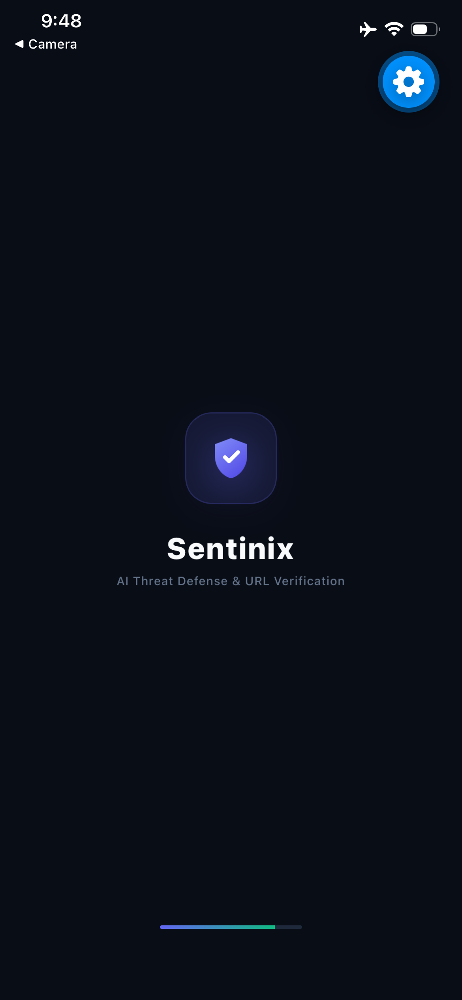
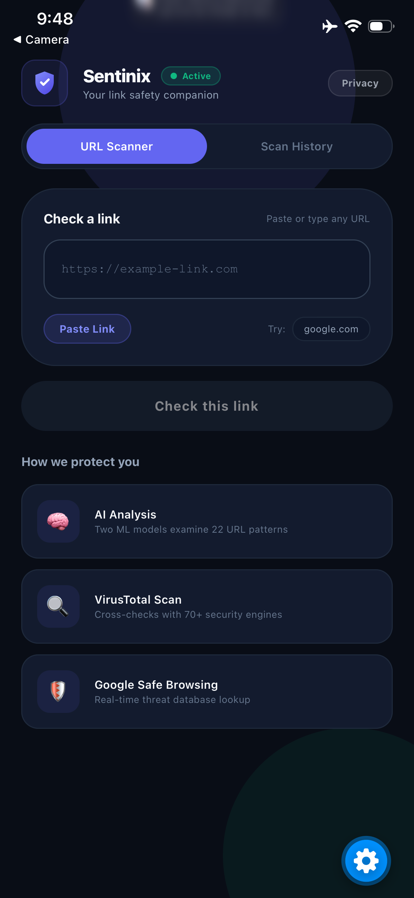
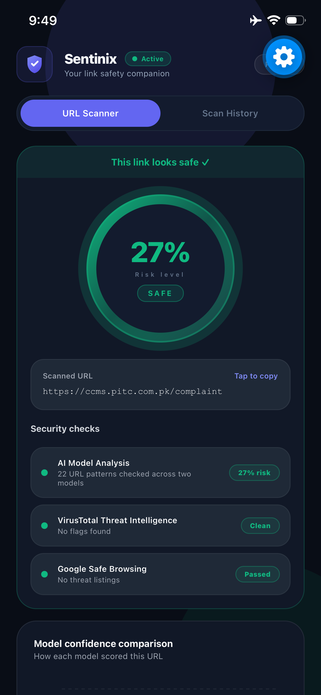
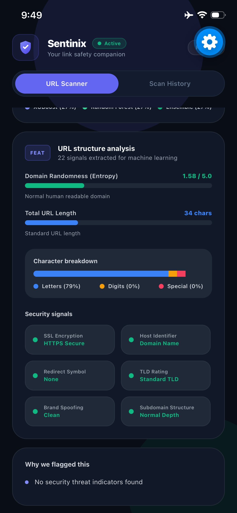
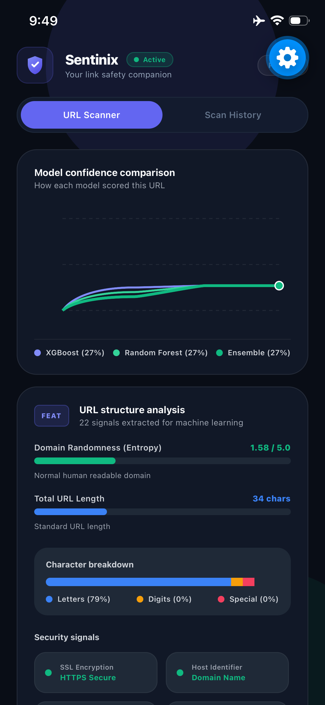
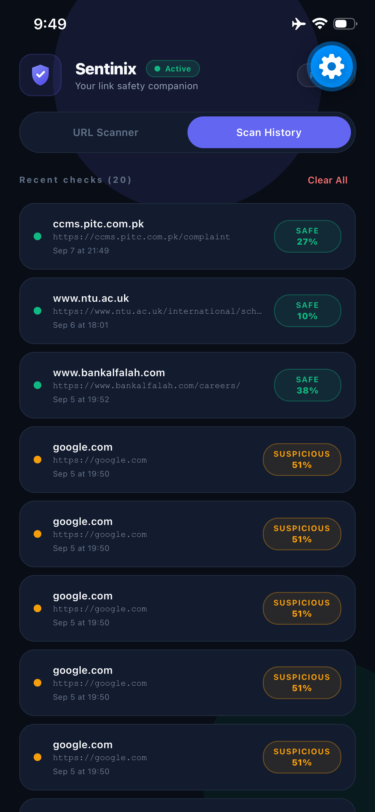
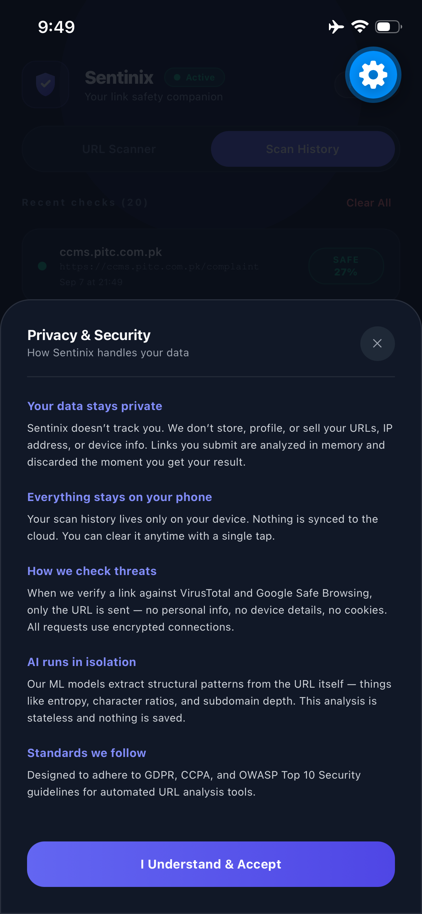

# Sentinix — AI-Powered Phishing URL Detection

A real-time phishing URL detection system built with machine learning and deployed as a cross-platform mobile application. It extracts 22 structural features directly from URL strings and passes them through a three-layer defense pipeline: dual ML classifiers, VirusTotal threat intelligence, and Google Safe Browsing verification.

Built as an independent research project after graduating from Bahria University Lahore (BS Computer Science, 2025).

---

## What it does

You paste a URL into the app. Within a couple of seconds it tells you whether that link is SAFE, SUSPICIOUS, or DANGEROUS, and explains exactly why. No page is rendered, no request is sent to the target host — the analysis runs entirely on the URL string itself, which means it is fast, safe, and works on any link before you click it.

---

## How the detection works

**Layer 1 — Dual ML classifiers**

Two models run in parallel on 22 structural URL features:

- Random Forest: AUC-ROC 0.9828, F1 0.9346
- XGBoost (HistGradientBoosting): AUC-ROC 0.9516, F1 0.8726

Both models were trained on 628,635 SMOTE-balanced samples from 549,346 raw URLs.

**Layer 2 — VirusTotal**

The URL is checked against 70+ antivirus and security engines via the VirusTotal v3 API. Any detections raise the risk score proportionally.

**Layer 3 — Google Safe Browsing**

A parallel check against Google's threat database covering MALWARE, SOCIAL_ENGINEERING, UNWANTED_SOFTWARE, and POTENTIALLY_HARMFUL_APPLICATION. A match forces the score to at least 0.95 (DANGEROUS).

**Verdict thresholds**

| Score | Verdict |
|-------|---------|
| 0.00 – 0.39 | SAFE |
| 0.40 – 0.69 | SUSPICIOUS |
| 0.70 – 1.00 | DANGEROUS |

---

## The 22 URL features

Features are extracted in under 2ms with no network requests to the target host.

| # | Feature | Type |
|---|---------|------|
| 1 | url_length | Integer |
| 2 | domain_length | Integer |
| 3 | path_length | Integer |
| 4 | query_length | Integer |
| 5 | has_at_symbol | Binary |
| 6 | has_ip_address | Binary |
| 7 | has_double_slash | Binary |
| 8 | has_dash_in_domain | Binary |
| 9 | has_port | Binary |
| 10 | dot_count | Integer |
| 11 | hyphen_count | Integer |
| 12 | param_count | Integer |
| 13 | special_char_ratio | Float |
| 14 | is_https | Binary |
| 15 | has_suspicious_tld | Binary |
| 16 | subdomain_depth | Integer |
| 17 | suspicious_word_count | Integer |
| 18 | brand_in_subdomain | Binary |
| 19 | domain_entropy | Float |
| 20 | url_entropy | Float |
| 21 | digit_ratio | Float |
| 22 | letter_ratio | Float |

---

## Tech stack

**Machine learning pipeline**
- Python 3.12
- scikit-learn (Random Forest + HistGradientBoostingClassifier)
- imbalanced-learn (SMOTE)
- pandas, numpy
- joblib (model serialization)

**Backend API**
- FastAPI
- uvicorn
- httpx (async requests to VirusTotal and Google Safe Browsing)
- tldextract
- Deployed on Vercel

**Mobile application**
- React Native 0.86.3
- Expo SDK 57
- TypeScript 6.0
- Expo Router 57
- React Native Reanimated 4.5.1
- React Native SVG 15.15.4
- Axios 1.20
- AsyncStorage (local scan history)
- Expo Haptics (tactile feedback)

---

## Model configuration

**Random Forest**
- n_estimators: 100
- max_depth: 15
- min_samples_split: 2

**HistGradientBoostingClassifier (XGBoost equivalent)**
- max_iter: 100
- learning_rate: 0.1
- max_depth: None (unconstrained)

Both models trained on 628,635 SMOTE-balanced samples. Test set: 157,159 samples drawn from the original raw distribution.

---

## Project structure

```
Sentinix/
├── phishing-detector/
│   ├── api/
│   │   └── index.py            # Scan endpoint + anti-bot middleware
│   ├── src/
│   │   ├── features.py         # 22-feature URL extractor
│   │   └── model.py            # Model loading and prediction
│   ├── models/
│   │   ├── rf_phishing_detector.pkl
│   │   ├── xgb_phishing_detector.pkl
│   │   ├── feature_names.json
│   │   └── model_metadata.json
│   ├── notebooks/
│   │   ├── 01_data_exploration.ipynb
│   │   ├── 02_feature_engineering.ipynb
│   │   └── 03_model_training.ipynb
│   └── requirements.txt
│
├── phishing-detector-app/
│   ├── src/
│   │   ├── app/
│   │   │   ├── index.tsx
│   │   │   └── _layout.tsx
│   │   ├── components/
│   │   │   ├── RiskGauge.tsx
│   │   │   ├── ModelLineChart.tsx
│   │   │   ├── StructuralFeatureCharts.tsx
│   │   │   ├── HistoryItem.tsx
│   │   │   ├── SplashScreen.tsx
│   │   │   ├── AppIcon.tsx
│   │   │   └── PrivacyPolicyModal.tsx
│   │   ├── hooks/
│   │   │   └── useScanner.ts
│   │   ├── utils/
│   │   │   ├── antiBot.ts
│   │   │   └── storage.ts
│   │   └── constants/
│   │       └── theme.ts
│   ├── app.json
│   └── package.json
│
├── screenshots/
└── README.md
```

---

## Screenshots

| Splash | Home | SAFE Verdict |
|--------|------|-------------|
|  |  |  |

| Model Chart | URL Analysis | History | Privacy |
|-------------|-------------|---------|---------|
|  |  |  |  |

---

## Running locally

### Backend

```bash
cd phishing-detector
```

Activate the virtual environment:

**Windows:**
```powershell
venv\Scripts\activate
```

**Mac / Linux:**
```bash
source venv/bin/activate
```

Install dependencies (first time only):

```bash
pip install -r requirements.txt
```

Copy the environment file and fill in your API keys:

**Windows:**
```powershell
copy .env.example .env
```

**Mac / Linux:**
```bash
cp .env.example .env
```

Start the server:

```bash
cd src
uvicorn api:app --reload --host 0.0.0.0 --port 8000
```

Test it:

**Windows (PowerShell):**
```powershell
Invoke-RestMethod -Uri "http://localhost:8000/scan" -Method POST -ContentType "application/json" -Body '{"url": "https://example.com"}'
```

**Mac / Linux:**
```bash
curl -X POST http://localhost:8000/scan \
  -H "Content-Type: application/json" \
  -d '{"url": "https://example.com"}'
```

The system works without API keys — it falls back to ML-only scoring.

---

### Mobile app

```bash
cd phishing-detector-app
npm install
```

Open `src/hooks/useScanner.ts` and set your machine's local IP:

```ts
const API_BASE = 'http://YOUR_LOCAL_IP:8000';
```

Find your local IP on Windows with `ipconfig` — look for IPv4 Address under your Wi-Fi adapter. Your phone and PC must be on the same network.

```bash
npx expo start
```

Scan the QR code in Expo Go on your phone.

---

## Model files

The trained `.pkl` files are included under `phishing-detector/models/`. The API loads them automatically on startup — no extra steps needed.

**Want to retrain from scratch?**

Run the three notebooks in order inside `phishing-detector/notebooks/`. Download the training data from the [Kaggle Phishing URL Dataset](https://www.kaggle.com/datasets/sid321axn/malicious-urls-dataset) and place the CSV in `phishing-detector/data/raw/`.

---

## Environment variables

Create `.env` inside `phishing-detector/` using `.env.example` as a template:

```
VIRUSTOTAL_API_KEY=your_key_here
SAFE_BROWSING_API_KEY=your_key_here
```

- VirusTotal free key: https://www.virustotal.com/gui/my-apikey
- Google Safe Browsing key: https://console.cloud.google.com (enable Safe Browsing API)

---

## Anti-bot security

Every scan request carries three cryptographic headers:

```
X-Sentinix-Client: Sentinix-Mobile-App/1.0
X-Sentinix-Timestamp: <unix_timestamp>
X-Sentinix-Signature: <fnv1a_dual_hash>
```

The backend validates the signature, rejects timestamps older than 300 seconds (replay protection), and enforces 20 requests per 60-second window per IP. The client enforces an additional 10 requests per 60-second limit before any request leaves the device.

---

## License

MIT License — see [LICENSE](LICENSE) for details.

---

## Author

**Tashad Tarij**
BS Computer Science — Bahria University Lahore (2025)
Independent researcher

[LinkedIn](https://www.linkedin.com/in/tashad-tarij-5230b02b5) · [Email](mailto:tashadrana224@gmail.com)
